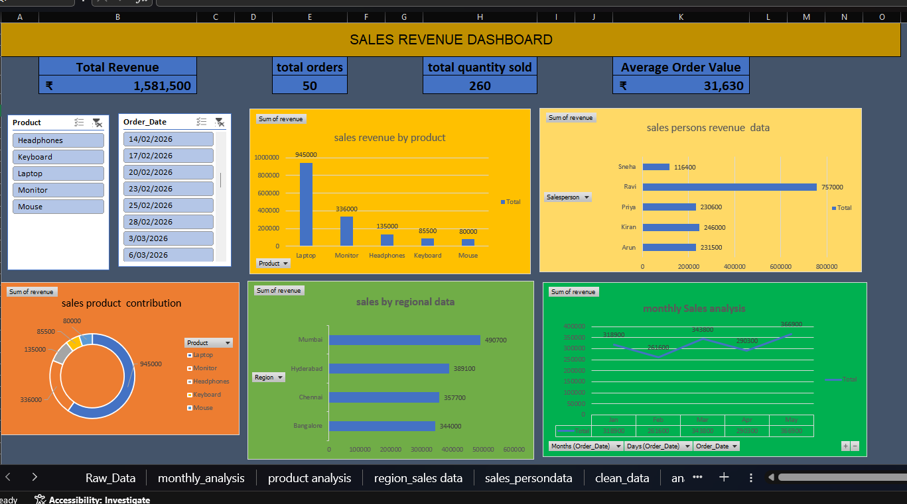

## Dashboard Preview

## Tools Used

- Microsoft Excel
- Pivot Tables
- Excel Charts
- Excel Formulas
- Data Cleaning

## Project Objective

The objective of this project is to analyze sales performance using Microsoft Excel and create an interactive dashboard to understand revenue, product performance, and monthly sales trends.

V## Project Workflow

1. Collected and organized sales data
2. Cleaned and prepared the data in Excel
3. Created Pivot Tables for analysis
4. Calculated key sales KPIs
5. Created charts to identify sales trends
6. Built an interactive Sales Performance Dashboard
7. Analyzed product and monthly sales performance

## Key Insights

- Identified overall sales performance using key sales KPIs
- Analyzed monthly sales trends
- Compared sales performance across products
- Used charts to make sales patterns easier to understand

## Project Files

- `sales.xlsx` – Excel workbook containing the sales analysis and dashboard
- `sales-dashboard.png` – Dashboard preview image
- `README.md` – Project documentation

## Skills Demonstrated

- Data Cleaning
- Excel Formulas
- Pivot Tables
- Data Analysis
- Data Visualization
- Dashboard Development

## How to Use

1. Download the `sales.xlsx` file.
2. Open the workbook in Microsoft Excel.
3. Explore the sales analysis and dashboard.
4. Use the dashboard to review sales performance, product performance, and monthly trends.

## About the Project

This project is a Sales Performance Analytics Dashboard created using Microsoft Excel. It analyzes sales data to track key performance indicators, product performance, and monthly sales trends through tables, formulas, Pivot Tables, and charts.

## Future Improvements

- Add more interactive filters and slicers
- Expand the dataset for deeper analysis
- Build a similar dashboard using Power BI
- Add advanced sales and customer analysis

  ## Conclusion

This project demonstrates how Microsoft Excel can be used to clean, analyze, and visualize sales data. The dashboard provides a clear view of sales performance and helps identify important trends and product-level performance.

